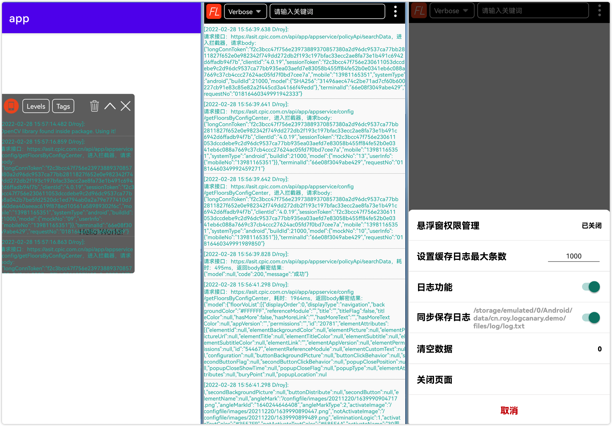

# LogCanary
## 简介
1. 起源：之前开发一个教育类App，应用有局域网内命令下发的使用场景，对于应用下发后，多个客户端是否收到下发的命令，没有一个方便的查看途径，所以考虑通过悬浮窗的形式，将信息输出到窗口。
2. 命名：之前想到过使用FloatLog作为该库的名称，后觉得不合适，由于开发这个库的时候有些实现方式参照了Android应用开发中有两个使用较广泛的库：LeakCanary（用于监控应用内存泄漏）和BlockCanary（用于监控应用卡顿），所以直接取名LogCanary。
3. 功能：提供脱离ADB时可查看应用内开发者输出的调试日志信息，具体效果如下所示：
   
   
## 实现原理
实现原理很简单，将开发者输出的日志显示到悬浮窗与日志Activity里，同时记录到日志文件，供后期使用，主要涉及的技术包括：
1. SPI机制debug版本与release版本日志功能动态实现
2. WindowManager实现悬浮日志窗口
3. Logback用于日志持久化
## 使用方式
### Gradle配置:
```javascript
repositories {
	...
	// 添加jitpack.io仓库地址
	maven { url 'https://jitpack.io' }
}
dependencies {
    /**
     * 将以下Tag改为release的最新版本，如最新Tag版本为1.0.1，则依赖为
     * debugImplementation 'com.github.zhouyige66.LogCanary:op:1.0.1'
     * releaseImplementation 'com.github.zhouyige66.LogCanary:no_op:1.0.1'
     */
    debugImplementation 'com.github.zhouyige66.LogCanary:op:Tag'
    releaseImplementation 'com.github.zhouyige66.LogCanary:no_op:Tag'
}
```
### 代码中使用
* 初始化
```java
LogCanaryManager.getInstance().init(this.getApplicationContext());
```
* 使用LogCanary提供的静态方法
```java
LogCanary.v(String tag, String msg);
LogCanary.v(String tag, String msg, Throwable throwable);
LogCanary.d(String tag, String msg);
LogCanary.d(String tag, String msg, Throwable throwable);
LogCanary.i(String tag, String msg);
LogCanary.i(String tag, String msg, Throwable throwable);
LogCanary.w(String tag, String msg);
LogCanary.w(String tag, String msg, Throwable throwable);
LogCanary.e(String tag, String msg);
LogCanary.e(String tag, String msg, Throwable throwable);
```
## 关于作者
* Email： zhouyige66@163.com
* 有任何建议或者使用中遇到问题都可以给我发邮件。